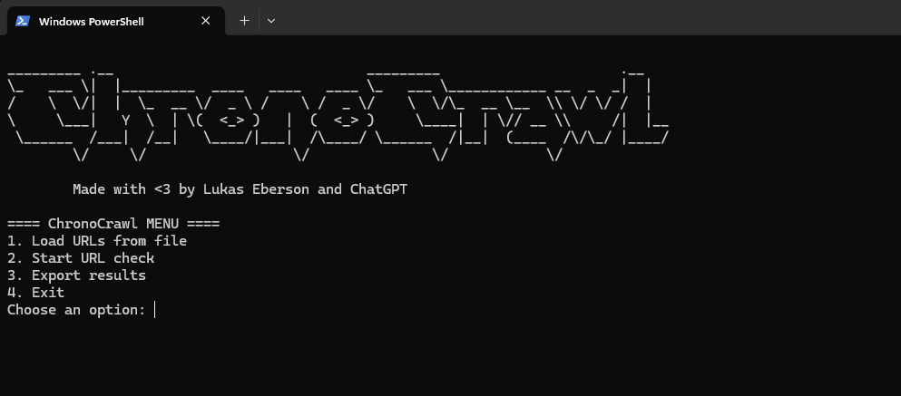

# 🛰️ ChronoCrawl
_The bot that touches the digital pulse_


ChronoCrawl is a terminal-based Python tool that checks whether websites listed in files are still online and contain recent content.
It supports `.txt`, `.csv`, and `.xlsx` input formats and exports results to `.csv` or `.xlsx`.

---

## 🚀 Features
- ✅ Load URLs from `.txt`, `.csv`, or `.xlsx`
- 🌐 Check if websites are reachable (HTTP status)
- 🔎 Detect if content contains the year **2025**
- 📦 Export results to `.csv` or `.xlsx`
- 🖥️ Easy-to-use terminal menu with progress output

---

## 📦 Installation

1. Clone the repository:
```bash
git clone https://github.com/LukasEberson/ChronoCrawl.git
cd ChronoCrawl
```

2. Install dependencies:
```bash
pip install -r requirements.txt
```

---

## 📁 Supported input formats

✔️ `.txt`: One URL per line or mixed text with valid `http://` or `https://` links  
✔️ `.csv`: First column must contain URLs (no header required)  
✔️ `.xlsx`: Same as `.csv`, URLs in the first column

### Example input (`urls.txt`)
```
https://example.com
https://anotherdomain.org/news
```

---

## 🧭 How to use

1. Run the main program:
```bash
python main.py
```

2. Follow the on-screen menu:
   - Option 1: Load your file (e.g. `C:\Users\YourName\Desktop\urls.txt`)
   - Option 2: Start scanning URLs (⚠️ don't close the terminal during scanning)
   - Option 3: Export results as `.csv` or `.xlsx`

3. Results are saved as `chrono_results.csv` or `chrono_results.xlsx` in the current folder.

---

## 🖼️ Screenshots

You can add screenshots like this once uploaded to the GitHub repo:

```markdown

```

Place your image in an `images/` folder inside the repo and push it.

---

## 🧠 Credits
Made with ❤️ by Lukas Eberson and ChatGPT

---

## 📄 License
MIT License
